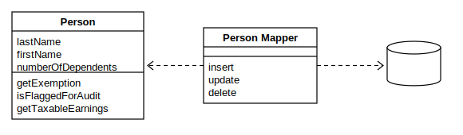

---
# You can also start simply with 'default'
theme: seriph
# random image from a curated Unsplash collection by Anthony
# like them? see https://unsplash.com/collections/94734566/slidev
background: https://cover.sli.dev
# some information about your slides (markdown enabled)
title: ActiveRecordの呪縛を越えて：DataMapperと不変性の間で「コシ」のある設計のバランスを模索する
info: |
  PHPカンファレンス香川2026
  https://phpcon.kagawa.jp/2026/
# apply unocss classes to the current slide
class: text-center
# https://sli.dev/features/drawing
drawings:
  persist: false
# slide transition: https://sli.dev/guide/animations.html#slide-transitions
transition: slide-left
seoMeta:
  ogImage: auto
# duration of the presentation, default is '30min'
duration: 30min
# timer mode, can be 'countdown' or 'stopwatch', default is 'stopwatch'
timer: stopwatch
# enable MDC Syntax: https://sli.dev/features/mdc
mdc: true
highlighter: shiki
css: unocss
colorSchema: dark
routerMode: hash
addons:
  - '@katzumi/slidev-addon-qrcode'
  - '@katzumi/slidev-addon-ogp-image'
  - slidev-addon-components
  - slidev-addon-rabbit
---

# ActiveRecordの呪縛を越えて：DataMapperと不変性の間で「コシ」のある設計のバランスを模索する

PHPカンファレンス香川 2026 May 9, 2026.  
v0.0.1  
@katzumi(かつみ)

<div @click="$slidev.nav.next" class="mt-12 py-1" hover:bg="white op-10">
  Press Space for next page <carbon:arrow-right />
</div>

<div class="abs-br m-6 text-xl">
  <button @click="$slidev.nav.openInEditor" title="Open in Editor" class="slidev-icon-btn">
    <carbon:edit />
  </button>
  <a href="https://github.com/k2tzumi/beyond-activerecord-into-datamapper" target="_blank" class="slidev-icon-btn">
    <carbon:logo-github />
  </a>
</div>

<!--
本日は「ActiveRecordの呪縛を越えて：DataMapperと不変性の間で「コシ」のある設計のバランスを模索する」というタイトルで、お話しさせていただきます。  
-->

---
transition: fade-out
layout: two-cols-header
class: text-left
---

# <carbon-user-avatar /> 自己紹介

katzumi（かつみ）と申します。

「障害のない社会をつくる」をビジョンとする「LITALICO（りたりこ）」に所属しています。
<a href="https://litalico.co.jp/" target="_blank">
  
</a>

以下のアカウントで活動しています。

::left::

<div class="flex items-center mb-6">
  

  <QRCode text="https://twitter.com/katzchum" class="w-28 h-28" />
</div>

<div class="flex items-center text-xl mt-4">
  <simple-icons-x class="mr-2" />
  <a href="https://twitter.com/katzchum" target="_blank" class="font-bold">katzchum</a>
</div>

::right::

<div class="flex flex-col space-y-4">
  <div class="flex items-center">
    
    <div class="flex flex-col">
      <div class="flex items-center text-xl">
        <logos-github-octocat class="mr-2" /> 
        <a href="https://github.com/k2tzumi" target="_blank" class="font-bold">k2tzumi</a>
      </div>
      <div class="flex items-center text-xl mt-2">
        <simple-icons-zenn class="mr-2 text-green-400" />
        <a href="https://zenn.dev/katzumi" target="_blank" class="font-bold">katzumi</a>
      </div>
    </div>
  </div>
</div>

<style>
/* タイトルのスタイルはそのまま維持 */
h1 {
  background-color: #2B90B6;
  background-image: linear-gradient(45deg, #4EC5D4 10%, #146b8c 20%);
  background-size: 100%;
  -webkit-background-clip: text;
  -moz-background-clip: text;
  -webkit-text-fill-color: transparent;
  -moz-text-fill-color: transparent;
}
</style>

<!--
みなさん、こんにちは。LITALICOの「かつみ」と申します。  
ご覧のXとGitHub等で活動しています。
-->

---
layout: two-cols-header
transition: fade-out
---

# <carbon-information /> お願い 🙏

写真撮影、SNS での実況について

登壇者の励みになるので是非ともご意見やご感想など、フィードバック頂けると助かります mm  
スライドの内容は、すでに以下の場所で公開されていますので、ぜひお手元でご覧ください  

* [forteeのプロポーザルページ](https://fortee.jp/phpconkagawa-2026/proposal/589a8ec7-ab79-4c14-893a-03b4dff32795)
* または <fa6-brands-square-x-twitter /> の投稿

::left::

<Transform :scale="2.5">
　　　🙆‍♀📷<ph-projector-screen-chart-light /><br />
　　　🙅‍♂📹💸<br />
　　　🙅📸👨‍👦‍👦<br />
</Transform>

::right::

<br />
<Transform :scale="2">
<fa6-brands-square-x-twitter />
</Transform>
<br />
<a href="https://x.com/search?q=%23phpconkagawa%20%23sotetsu&f=live">#phpconkagawa #sotetsu</a>

<!--
まずはじめにお願いです。写真撮影、SNSでの実況、大歓迎です。スライドも公開済みですので、ぜひハッシュタグをつけて、ご意見やご感想をフィードバックいただけると励みになります。
-->

---

# <carbon-presentation-file /> 本日のお話すること
お品書き

1. Eloquent運用で何がつらかったのか  
詰め替えコストとドメイン汚染
2. Data Mapper / Doctrine に何を期待したのか  
POPO と責務分離の魅力
3. なぜ途中でハマったのか  
immutable な設計と Unit of Work の衝突
4. 最後にどう着地したのか  
mutable な Entity とガードレール、そして残るジレンマ

<!--
今日は Doctrine の使い方を網羅する話ではなく、  
Eloquent から Data Mapper に寄せたときに  
何が楽になり、どこで設計が衝突したかを整理して話します
-->

---

# 皆さんのEloquentの向き合い方はどれ？
ActiveRecord指向のフレームワークでRepositoryパターンを無理に導入するとアレなの？

1. EloquentをActiveRecordとして素直に使う  
Repositoryは不要。UseCaseからEloquentを直接叩く。Laravelのレールに最も乗った形
2. EloquentをQueryBuilderとしてのみ使う  
Eloquentはインフラ層に閉じ込め、ドメイン層では独自のモデルやDTOへ詰め替える
3. Eloquent自体を捨てる  
DDDを本気でやるなら適材適所。他のツールを選んだり、PDOで生でSQL書いたり

<!--
本題に入る前に、皆さんに質問です。  
Laravelを使っているプロジェクトで、Eloquentとどう向き合っていますか？   
おそらく、以下の3つのパターンのどこかに当てはまるのではないでしょうか。
-->

---
layout: two-cols-header
transition: fade-out
---

# 私のこれまでの立ち位置
EloquentをQueryBuilderとして使い、DTOへ詰め替える」というアプローチ


::left::

<v-click>

* 読み取り時
```php
/**
 * 読み取り時の詰め替え (Eloquent -> Domain Model)
 */
public function find(int $id): ?User
{
  $eloquentUser = UserEloquent::find($id);

  if (!$eloquentUser) {
    return null;
  }

  // ここでプロパティを一つずつマッピングする作業が発生する
  return new User(
    id: $eloquentUser->id,
    name: $eloquentUser->name,
    email: $eloquentUser->email,
    address: $eloquentUser->address,
    phoneNumber: $eloquentUser->phone_number,
    isActive: (bool)$eloquentUser->is_active,
    createdAt: new \DateTimeImmutable($eloquentUser->created_at)
  );
}
```
</v-click>

::right::

<v-click>

* 書き込み時
```php
  /**
   * 書き込み時の詰め替え (Domain Model -> Eloquent)
   */
  public function save(User $user): void
  {
    $eloquentUser = UserEloquent::findOrNew($user->id);

    // 保存時も同様に一つずつ値を詰め直す
    $eloquentUser->name = $user->name;
    $eloquentUser->email = $user->email;
    $eloquentUser->address = $user->address;
    $eloquentUser->phone_number = $user->phoneNumber;
    $eloquentUser->is_active = $user->isActive;
    // created_atはEloquentのタイムスタンプ機能に任せる場合が多いが、
    // 明示的に扱う場合はここでも変換が必要

    $eloquentUser->save();
  }
```
</v-click>


---

# 辛い。。
変換コードが増え続ける

カラムが増えるたびに、この相互変換のコードが膨れ上がる。   
本質的なツラミは、ドメインモデルと永続化モデル ( `Eloquent` ) が二重化しして、整合性コストが増えること  
その結果、変更のたびに読み書き両方を直す必要がある  
又、Queryやコマンドのパターンが増えるごとにコード量も比例する構造になる

---

# もっと根深い

<OgpImage url="https://www.docswell.com/s/katzumi/Z989R9-activerecord-pattern-unlearning-clean-architecture" />


今回のタイトルの `呪縛` というワードはこのスライドからきています

<!--
このスライドにある取り組みをおこなってきましたが、今回は更に発展して取り組んできた学びを発表します
-->


---

# 不協和音の正体
設計思想が強すぎる

* POPO(Plain Old PHP Object)なドメインモデル vs Laravel Eloquent  
相互変換（Mapping）の苦痛：プロパティの二重管理、子レコード差分の手動反映  
→ ドメインモデルとPersistenceモデルの構造的ズレ

---

# ドメインは汚したくない
POPOにしたい！

* 関心を分離したい  
ドメインモデルは「業務ルール」を表す場所で、永続化やSQL最適化の都合は本来インフラ層の責務
* テストしやすくしたい  
POPOならDB接続なしで高速にユニットテストできる  
業務ルールのテスト失敗を、インフラ要因と分離しやすい
* 変更耐性を上げたい  
業務変更と無関係なDB最適化でも、ドメインへの波及を抑えやすい

---

# DataMapperパターンという希望


<div>



</div>

---

# DataMapperとは？

<blockquote>
オブジェクトとデータベースの間でデータをやり取りするためのマッパー層。これにより、オブジェクトとデータベース、そしてマッパー自身が互いに独立した状態に保たれます。<br />

`A layer of mappers that moves data between objects and a database while keeping them independent of each other and the mapper itself.`
</blockquote>

refs: https://martinfowler.com/eaaCatalog/dataMapper.html


---

# ActiveRecordとは？

<blockquote>
データベースのテーブルやビューの1行をラップし、データベースへのアクセスをカプセル化して、そのデータに対するドメインロジックを追加するオブジェクト。<br />

`An object that wraps a row in a database table or view, encapsulates the database access, and adds domain logic on that data.`
</blockquote>

refs: https://www.martinfowler.com/eaaCatalog/activeRecord.html

---

# ActiveRecordとの違い

<div class="relative mx-auto w-240 max-w-full h-76 border rounded-xl border-slate-500/40 bg-white/5 overflow-hidden">
  <div
    v-motion
    :initial="{ x: 0, y: 0, opacity: 1, scale: 1, height: 268 }"
    :enter="{ x: 0, y: 0, opacity: 1, scale: 1, height: 268 }"
    :click-1="{ height: 218 }"
    style="position: absolute; left: 22px; top: 18px; width: 240px; border: 1px solid rgba(148,163,184,0.7); border-radius: 8px; background: rgba(255,255,255,0.04);"
  >
    <div style="border-bottom: 1px solid rgba(148,163,184,0.7); padding: 8px 12px; font-weight: 600;">Person</div>
    <div style="padding: 10px 12px; font-family: ui-monospace, SFMono-Regular, Menlo, monospace; font-size: 12px; opacity: 0.88; line-height: 1.6;">
      lastName<br>
      firstName<br>
      numberOfDependents
    </div>
    <div style="border-top: 1px solid rgba(148,163,184,0.7); padding: 10px 12px 0; font-family: ui-monospace, SFMono-Regular, Menlo, monospace; font-size: 12px; line-height: 1.65;">
      getExemption()<br>
      isFlaggedForAudit()<br>
      getTaxableEarnings()
    </div>
    <div v-click="1" class="absolute right-10px bottom-10px text-11px text-indigo-300">Domain Object</div>
  </div>

  <div
    v-motion
    :initial="{ x: 0, y: 0, width: 212, height: 138, opacity: 0.24 }"
    :enter="{ x: 0, y: 0, width: 212, height: 138, opacity: 0.24 }"
    :click-1="{ x: -30, y: 28, width: 232, height: 182, opacity: 1 }"
    style="position: absolute; left: 336px; top: 24px; border: 1px solid rgba(148,163,184,0.8); border-radius: 8px; background: rgba(255,255,255,0.06);"
  >
    <div style="border-bottom: 1px solid rgba(148,163,184,0.65); padding: 8px 12px; font-weight: 600;">Person Mapper</div>
    <div class="p-10px font-mono text-12px leading-7">
      <div v-click="1">insert()</div>
      <div v-click="1">update()</div>
      <div v-click="1">delete()</div>
    </div>
    <div v-click="1" class="absolute right-10px bottom-10px text-11px text-indigo-300">DataMapper</div>
  </div>

  <div
    v-motion
    :initial="{ x: 0, y: 0 }"
    :enter="{ x: 0, y: 0 }"
    :click-1="{ x: 8, y: -18 }"
    style="position: absolute; left: 544px; top: 164px; width: 92px; height: 58px; border: 1px solid rgba(148,163,184,0.75); border-radius: 999px / 48px; display: flex; align-items: center; justify-content: center; font-size: 12px;"
  >
    DB
  </div>

  <div
    v-motion
    :initial="{ x: 0, y: 0, width: 260 }"
    :enter="{ x: 0, y: 0, width: 260 }"
    :click-1="{ x: 274, y: -42, width: 18 }"
    style="position: absolute; left: 266px; top: 216px; border-top: 2px dashed rgba(148,163,184,0.75);"
  ></div>
  <div v-click.hide="1" class="absolute left-530px top-208px text-14px opacity-80">→</div>
  <div v-click="1" class="absolute left-294px top-116px text-14px opacity-80">←</div>
  <div v-click="1" class="absolute left-560px top-166px text-14px opacity-80">→</div>

  <div
    v-motion
    :initial="{ x: 0, y: 0, opacity: 1 }"
    :enter="{ x: 0, y: 0, opacity: 1 }"
    :click-1="{ x: 284, y: -96, opacity: 1 }"
    style="position: absolute; left: 44px; top: 234px; font-family: ui-monospace, SFMono-Regular, Menlo, monospace; font-size: 12px; color: #f59e0b;"
  >
    insert()
  </div>
  <div
    v-motion
    :initial="{ x: 0, y: 0, opacity: 1 }"
    :enter="{ x: 0, y: 0, opacity: 1 }"
    :click-1="{ x: 284, y: -84, opacity: 1 }"
    style="position: absolute; left: 44px; top: 250px; font-family: ui-monospace, SFMono-Regular, Menlo, monospace; font-size: 12px; color: #f59e0b;"
  >
    update()
  </div>

  <div v-click.hide="1" class="absolute left-270px top-232px text-12px text-amber-500">DB 永続化の責務</div>
</div>

<div v-click="1" class="text-sm mt-3 opacity-85">
  Data Mapper 完了: Person は純粋なドメインオブジェクト、永続化責務は Person Mapper へ分離
</div>


---

# なぜDoctrineなのか？

* ドメイン自身が永続化の関心ごとから完全に隔離されることができる  
POPOなEntity ＋ 独立したXMLマッピングによる完全な分離。
* ドメインモデルとPersistenceモデルを一つのクラスで扱える効率性。

<div 
  v-click="1"
  class="absolute inset-0 z-20 flex items-center justify-center bg-black/50 backdrop-blur-sm transition duration-700 ease-in-out"
  :class="$clicks < 1 ? 'opacity-0 pointer-events-none' : 'opacity-100 pointer-events-auto'"
>
  <div 
    class="p-10 bg-white/10 backdrop-blur-lg border-4 border-green-400 rounded-2xl shadow-2xl transform scale-125 transition duration-500"
  >
    <h3 class="text-5xl font-extrabold text-white mb-4">永続性の無視 (Persistence Ignorance) </h3>
    <p class="text-2xl text-green-300 font-bold tracking-wide leading-relaxed">
      <span class="text-yellow-300 font-bold">永続化の細部を、アプリケーションの他の部分からカプセル化</span><br />
    </p>
  </div>
</div>


---

# Doctrineの導入後の世界

```php
// src/Domain/Model/Product.php
class Product {
    // 永続化に付随するメタデータ（ハイドレーションでセット）
    private readonly　int $id = null;
    private readonly \DateTimeImmutable $updatedAt;
    
    public function __construct(
        private readonly Code $code, // ビジネス上の識別子
        private readonly　string $name,
        private readonly　Price $price
    ) {
        if (mb_strlen($name) < 3)
            throw new \InvalidArgumentException("商品名は3文字以上必要です");
    }

    public function applyCampaignPrice(Price $campaignPrice): self {
        if ($campaignPrice->amount >= $this->price->amount) {
            throw new \DomainException("キャンペーン価格は通常価格より安く設定してください");
        }
        return new self($this->code, $this->name, $this->price);
    }
}
```

<div 
  v-click="1"
  class="absolute inset-0 z-20 flex items-center justify-center bg-black/50 backdrop-blur-sm transition duration-700 ease-in-out"
  :class="$clicks < 1 ? 'opacity-0 pointer-events-none' : 'opacity-100 pointer-events-auto'"
>
  <div 
    class="p-10 bg-white/10 backdrop-blur-lg border-4 border-green-400 rounded-2xl shadow-2xl transform scale-125 transition duration-500"
  >
    <h3 class="text-5xl font-extrabold text-white mb-4">純度の高いPOPOとしてドメインモデルとして定義できる</h3>
    <p class="text-2xl text-green-300 font-bold tracking-wide leading-relaxed">
      <span class="text-yellow-300 font-bold">コンストラクタがビジネス上必要な情報だけを受け取る</span><br />
      <span class="text-yellow-300 font-bold">永続化に付属するメタデータ ( id 等 ) は非公開で保持</span><br />
      <span class="text-green-200 font-semibold text-xl">└ ドメイン層・アプリケーション層からは見えない（private)</span><br />
      <span class="text-green-200 font-semibold text-xl">└ Doctrineがリフレクション経由でハイドレーション時にセット</span><br />
      <span class="text-yellow-300 font-bold">同じクラスでも「ドメインの責務」と「永続化の責務」は分離</span><br />
    </p>
  </div>
</div>


---

# XML Mapping (インフラ層)

```xml
<!-- src/Infrastructure/ORM/mapping/Product.dcm.xml -->
<doctrine-mapping>
  <entity name="App\Domain\Model\Product" table="products">
    <!-- 永続化に付随するメタデータをマッピングできる -->
    <id name="id" type="bigint" column="id">
      <options>
        <option name="unsigned">true</option>
      </options>
      <generator strategy="AUTO" />
    </id>
    <!-- ビジネスキー Custom Type でVOと変換 -->
    <field name="code" type="code" length="19" column="code" nullable="false" />
    <field name="name" type="string" length="255" />
    <field name="price" type="price" column="price" nullable="false"/>    
    <!-- 更新日時 -->
    <field name="updatedAt" type="datetime_immutable" column="updated_at" />
  </entity>
</doctrine-mapping>
```


<div 
  v-click="1"
  class="absolute inset-0 z-20 flex items-center justify-center bg-black/50 backdrop-blur-sm transition duration-700 ease-in-out"
  :class="$clicks < 1 ? 'opacity-0 pointer-events-none' : 'opacity-100 pointer-events-auto'"
>
  <div 
    class="p-10 bg-white/10 backdrop-blur-lg border-4 border-green-400 rounded-2xl shadow-2xl transform scale-125 transition duration-500"
  >
    <h3 class="text-5xl font-extrabold text-white mb-4">独立したXMLマッピング</h3>
    <p class="text-2xl text-green-300 font-bold tracking-wide leading-relaxed">
      <span class="text-yellow-300 font-bold">手続きなし</span><br />
      <span class="text-yellow-300 font-bold">AttributeでModelに埋め込みも可能</span><br />
      <span class="text-yellow-300 font-bold">永続化責務はマッピングXMLで分離できる</span><br />
    </p>
  </div>
</div>


---

# リポジトリ層の実装

```php
<?php
final class DoctrineProductRepository implements ProductRepositoryInterface
{
    public function __construct(private EntityManagerInterface $em) {}

    // モデルの永続化
    public function save(Product $product): void {
        $this->em->persist($product);
        $this->em->flush();
    }

    // モデルの呼び出し
    public function findById(int $id): ?Product {
        return $this->em->find(Product::class, $id);
    }
}
```

<div 
  v-click="1"
  class="absolute inset-0 z-20 flex items-center justify-center bg-black/50 backdrop-blur-sm transition duration-700 ease-in-out"
  :class="$clicks < 1 ? 'opacity-0 pointer-events-none' : 'opacity-100 pointer-events-auto'"
>
  <div 
    class="p-10 bg-white/10 backdrop-blur-lg border-4 border-green-400 rounded-2xl shadow-2xl transform scale-125 transition duration-500"
  >
    <h3 class="text-5xl font-extrabold text-white mb-4">雑な最小実装だとこんな感じ</h3>
    <p class="text-2xl text-green-300 font-bold tracking-wide leading-relaxed">
      <span class="text-yellow-300 font-bold">プロパティの詰め替えは不要</span><br />
      <span class="text-green-200 font-semibold text-xl">永続化も基本persistしてflushするだけ</span><br />
      <span class="text-yellow-300 font-bold">登場するModelは一つのドメインモデルのみ！</span><br />
    </p>
  </div>
</div>

---

# LaravelerによるDoctrineの1stインプレッション
狙い通りの効果はありそう

* リポジトリ層でのデータの詰め直しはなくなった
* ドメインモデルとPersistenceモデルを同一クラスで運用しつつ、責務はマッピング層で分離できる

---

# いい感じ 👍️
# やっていき 💪

---

# 見た目はかなり素直

```php
$user = $repo->findById($id);

$user->rename('新しいお名前');

$repo->save($user);
```
※説明の為に簡略化したコードになっています


<div 
  v-click="1"
  class="absolute inset-0 z-20 flex items-center justify-center bg-black/50 backdrop-blur-sm transition duration-700 ease-in-out"
  :class="$clicks < 1 ? 'opacity-0 pointer-events-none' : 'opacity-100 pointer-events-auto'"
>
  <div 
    class="p-10 bg-white/10 backdrop-blur-lg border-4 border-green-400 rounded-2xl shadow-2xl transform scale-125 transition duration-500"
  >
    <h3 class="text-5xl font-extrabold text-white mb-4">これで勝ったのでは？</h3>
    <p class="text-2xl text-green-300 font-bold tracking-wide leading-relaxed">
      <span class="text-yellow-300 font-bold">Eloquentの save 感覚に近い</span><br />
      <span class="text-yellow-300 font-bold">詰め替えコードも不要</span><br />
    </p>
  </div>
</div>

<!--
ここまでは本当に良かったんです。Laravel で `save()` に慣れていると、これならいけるじゃん、となる。
-->

---

# 結構いいかんじ…のはずだった
ところが、ある日バグ報告が来る

<v-click at="1">
更新したつもりだった。。<br />
</v-click>

<v-click at="2">

<div class="speech-bubble">
「値引き更新したのに、商品が増えてませんか？」
</div>
<br />

```php
$product = $repo->findById($id);

$discounted = $product->applyCampaignPrice($campaignPrice);

$repo->save($discounted);
```
※説明の為に簡略化したコードになっています
</v-click>

<div 
  v-click="3"
  class="absolute inset-0 z-20 flex items-center justify-center bg-black/50 backdrop-blur-sm transition duration-700 ease-in-out"
  :class="$clicks < 3 ? 'opacity-0 pointer-events-none' : 'opacity-100 pointer-events-auto'"
>
  <div 
    class="p-10 bg-white/10 backdrop-blur-lg border-4 border-green-400 rounded-2xl shadow-2xl transform scale-125 transition duration-500"
  >
    <h3 class="text-5xl font-extrabold text-white mb-4">UPDATE のつもりが INSERT？🤔</h3>
    <p class="text-2xl text-green-300 font-bold tracking-wide leading-relaxed">
      <span class="text-green-200 font-semibold text-xl"> DB を見ると行が増えたり</span><br />
      <span class="text-green-200 font-semibold text-xl"> 一意制約エラーが発生する</span><br />
    </p>
  </div>
</div>

---

# モデルによっては更新がうまくいったり、更新でレコードが増えたり。。
# (ﾟＡﾟ;)ｺﾞｸﾘ

---
layout: two-cols-header
transition: fade-out
---

# 何が起きているのか分からない

::left::

## update されるケース

```php
$user = $repo->findById($id);
$user->rename('新しいお名前');
$repo->save($user);
```

::right::

## insert されるケース

```php
$product = $repo->findById($id);
$discounted = $product->applyCampaignPrice($campaignPrice);
$repo->save($discounted);
```

<div 
  v-click="1"
  class="absolute inset-0 z-20 flex items-center justify-center bg-black/50 backdrop-blur-sm transition duration-700 ease-in-out"
  :class="$clicks < 1 ? 'opacity-0 pointer-events-none' : 'opacity-100 pointer-events-auto'"
>
  <div 
    class="p-10 bg-white/10 backdrop-blur-lg border-4 border-green-400 rounded-2xl shadow-2xl transform scale-125 transition duration-500"
  >
    <h3 class="text-5xl font-extrabold text-white mb-4">コードレビューではどちらも自然に見える</h3>
    <p class="text-2xl text-green-300 font-bold tracking-wide leading-relaxed">
      <span class="text-yellow-300 font-bold">でも結果だけが違う</span><br />
    </p>
  </div>
</div>


---
layout: two-cols-header
transition: fade-out
---

# おわかり頂けただろうか？。。

::left::

## update されるケース

```php {all|2-3}
$user = $repo->findById($id);
$user->rename('新しいお名前');
$repo->save($user);
```

<v-click at="1">

<div class="speech-bubble">
同じインスタンスをそのまま保存
</div>

</v-click>


::right::

## insert されるケース

```php {all|2-3}
$product = $repo->findById($id);
$discounted = $product->applyCampaignPrice($campaignPrice);
$repo->save($discounted);
```
<v-clicks at=2>
<div class="speech-bubble">
新しいインスタンスを作って保存
</div>
</v-clicks>

---

# どうすればよかったのか？。。

---

# 色々悩みながらこの様に対処しました
saveを辞めて DQL(Doctrine Query Language)でUPDATE文を記述する

```php
public function updatePrice(Code $code, Price $newPrice, \DateTimeImmutable $lastUpdatedAt): void
{
    // 1. DQLを組み立てる（プロパティが増えるたびにここが肥大化・複雑化する）
    $query = $this->em->createQuery(
        'UPDATE ' . Product::class . ' p 
         SET p.price.amount = :newPrice, 
             p.updatedAt = :now
         WHERE p.code = :code 
         AND p.updatedAt = :expectedUpdatedAt' // 楽観ロック
    );
    // 2. メソッドチェーンでパラメータをセット（非常に冗長）
    $query->setParameter('newPrice', $newPrice->amount)
          ->setParameter('now', new \DateTimeImmutable())
          ->setParameter('code', $code)
          ->setParameter('expectedUpdatedAt', $lastUpdatedAt); // 型やミリ秒精度の問題に泣かされる
    // 3. 実行
    $affectedRows = $query->execute();

    // 4. 楽観ロックの判定を自前で行う
    if ($affectedRows === 0) {
        throw new \RuntimeException("楽観ロック失敗：他者により更新、または同時刻の更新による不一致。");
    }
}
```

<div 
  v-click="1"
  class="absolute inset-0 z-20 flex items-center justify-center bg-black/50 backdrop-blur-sm transition duration-700 ease-in-out"
  :class="$clicks < 1 ? 'opacity-0 pointer-events-none' : 'opacity-100 pointer-events-auto'"
>
  <div 
    class="p-10 bg-white/10 backdrop-blur-lg border-4 border-green-400 rounded-2xl shadow-2xl transform scale-125 transition duration-500"
  >
    <h3 class="text-5xl font-extrabold text-white mb-4">一気にコード量が増える 🤮</h3>
  </div>
</div>

---

# もっと楽になると思ってたのに
DataMapper に来たのに、また手で書いてる…

変更箇所だけDQLでupdate
* 更新系だけ DQL を個別に書き始める
* ユースケースごとに update メソッドが増えていく  
* 楽観ロックの対応ってこれで良かったっけ？

<div 
  v-click="1"
  class="absolute inset-0 z-20 flex items-center justify-center bg-black/50 backdrop-blur-sm transition duration-700 ease-in-out"
  :class="$clicks < 1 ? 'opacity-0 pointer-events-none' : 'opacity-100 pointer-events-auto'"
>
  <div 
    class="p-10 bg-white/10 backdrop-blur-lg border-4 border-green-400 rounded-2xl shadow-2xl transform scale-125 transition duration-500"
  >
    <h3 class="text-5xl font-extrabold text-white mb-4">開発者からの悲鳴</h3>
    <p class="text-2xl text-green-300 font-bold tracking-wide leading-relaxed">
      <span class="text-yellow-300 font-bold">もっと楽にできないの？</span><br />
    </p>
  </div>
</div>

---

# どうしてこうなった？
バグの原因は save メソッドそのものではなかった

```php {all|1,5}
public function applyCampaignPrice(Price $campaignPrice): self {
 if ($campaignPrice->amount >= $this->price->amount) {
  throw new \DomainException("キャンペーン価格は通常価格より安く設定してください");
  }
  return new self($this->code, $this->name, $this->price);
}
```

<v-click at=1>
<div class="speech-bubble">
immutable にしたことで、新しい Product を返していた
</div>
</v-click>

<div 
  v-click="2"
  class="absolute inset-0 z-20 flex items-center justify-center bg-black/50 backdrop-blur-sm transition duration-700 ease-in-out"
  :class="$clicks < 2 ? 'opacity-0 pointer-events-none' : 'opacity-100 pointer-events-auto'"
>
  <div 
    class="p-10 bg-white/10 backdrop-blur-lg border-4 border-green-400 rounded-2xl shadow-2xl transform scale-125 transition duration-500"
  >
    <h3 class="text-5xl font-extrabold text-white mb-4">Doctrine から見ると</h3>
    <p class="text-2xl text-green-300 font-bold tracking-wide leading-relaxed">
      <span class="text-yellow-300 font-bold">それは「更新対象」ではなく「別のオブジェクト」</span><br />
    </p>
  </div>
</div>

---

#  Doctrineは「同じオブジェクトの変化」を追いかける

- `findById()` で取った Entity は管理対象
- その同じインスタンスが変更されれば UPDATE できる
- でも新しいインスタンスを返すと追跡対象から外れる
- だから save しても UPDATE のつもりが INSERT 側に倒れる

<div 
  v-click="1"
  class="absolute inset-0 z-20 flex items-center justify-center bg-black/50 backdrop-blur-sm transition duration-700 ease-in-out"
  :class="$clicks < 1 ? 'opacity-0 pointer-events-none' : 'opacity-100 pointer-events-auto'"
>
  <div 
    class="p-10 bg-white/10 backdrop-blur-lg border-4 border-green-400 rounded-2xl shadow-2xl transform scale-125 transition duration-500"
  >
    <h3 class="text-5xl font-extrabold text-white mb-4">以下の相性がよくなかった</h3>
    <p class="text-2xl text-green-300 font-bold tracking-wide leading-relaxed">
      <span class="text-yellow-300 font-bold">Doctrine は悪くない</span><br />
      <span class="text-green-200 font-semibold text-xl">* Doctrine が前提としている変更モデル</span><br />
      <span class="text-green-200 font-semibold text-xl">* immutable な設計</span><br />
    </p>
  </div>
</div>

---

# Unit of Workというもの
同じオブジェクトの変化を追いかけるのはUnit of Workの中核的機能

* 業務トランザクション中に触ったオブジェクトを覚えて、何を最後に DB へ書くかを調整する仕組み
* 以下の機能を有しています
  * 新規追加、削除、更新の取りまとめ
  * 書き込み順序の調整（集約ルートの更新）
  * 同時実行の問題への対処（楽観ロック等）
  * 同じレコードを同じインスタンスとして扱う仕組み( [Identity Map](https://martinfowler.com/eaaCatalog/identityMap.html) )

<div 
  v-click="1"
  class="absolute inset-0 z-20 flex items-center justify-center bg-black/50 backdrop-blur-sm transition duration-700 ease-in-out"
  :class="$clicks < 1 ? 'opacity-0 pointer-events-none' : 'opacity-100 pointer-events-auto'"
>
  <div 
    class="p-10 bg-white/10 backdrop-blur-lg border-4 border-green-400 rounded-2xl shadow-2xl transform scale-125 transition duration-500"
  >
    <h3 class="text-5xl font-extrabold text-white mb-4">Unit of Workの恩恵を最大限受けるには</h3>
    <p class="text-2xl text-green-300 font-bold tracking-wide leading-relaxed">
      <span class="text-yellow-300 font-bold">Entityをmutableにして変更を追跡させる必要がある</span><br />
    </p>
  </div>
</div>

---

# つまり、衝突していたのは設計思想だった

- ドメインは immutable にしたい
- Doctrine は mutable な変更追跡が前提となる
- そのズレを埋めるために DQL や個別更新が増えた
- 便利になるはずが、別の複雑さを呼び込んだ

<div 
  v-click="1"
  class="absolute inset-0 z-20 flex items-center justify-center bg-black/50 backdrop-blur-sm transition duration-700 ease-in-out"
  :class="$clicks < 1 ? 'opacity-0 pointer-events-none' : 'opacity-100 pointer-events-auto'"
>
  <div 
    class="p-10 bg-white/10 backdrop-blur-lg border-4 border-green-400 rounded-2xl shadow-2xl transform scale-125 transition duration-500"
  >
    <h3 class="text-5xl font-extrabold text-white mb-4">DataMapper を選んだつもりでしたが、、</h3>
    <p class="text-2xl text-green-300 font-bold tracking-wide leading-relaxed">
      <span class="text-yellow-300 font-bold">実際には Unit of Work の作法まで引き受ける必要があった</span><br />
    </p>
  </div>
</div>

---

#  なぜイミュータブルにしたいのか？
状態変化はバグの温床である

ミュータブルなオブジェクトが引き起こす問題

- 予期せぬ副作用
- 時間的結合（メソッドの呼び出し順序に依存する壊れやすさ）
- スレッド安全性の欠如（並行処理でのデータ競合）
- 変更追跡の困難さ（どこで状態が変わったか追いにくい）  

コードの実行順序（時間軸）を脳内でシミュレーションしなければならず認知負荷が高い  
その関数（またはクラス）の中身だけを読めば、何が起きるか100%理解できる状態が崩れる


DDDの文脈では、Eric EvansがValue Object はイミュータブルであるべきと触れられています

---

# イミュータブルな設計とは？
関数型ドメインモデリングのアプローチ

1. 不正な状態を「表現不可能」にする  
強力な型システム（代数的データ型など）を活用して、 **「ビジネスルールに反する状態は、そもそもコンパイルエラーになる」** ように設計する  
コンストラクタで制約を定義して、不正な状態を作れない様にします  
直接プロパティを書き換えるインターフェースは定義しません
2. ビジネスロジックと「副作用」を完全に分離する  
データベースにもネットワークにも依存しない「純粋な関数」の集まりとして定義します  
「現在の状態」と「コマンド」を受け取り、「新しい状態」または「発生したイベント」を返却します

---

# イミュータブルの強制ギブスとしてのread only class
手っ取り早くイミュータブルな設計を担保させるのであれば、read only classが楽

PHP の言語機能で制約を強制できる

readonly クラスは、PHP 8.2 から導入されました
readonly class は、宣言された全プロパティを暗黙的に readonly にします

<div 
  v-click="1"
  class="absolute inset-0 z-20 flex items-center justify-center bg-black/50 backdrop-blur-sm transition duration-700 ease-in-out"
  :class="$clicks < 1 ? 'opacity-0 pointer-events-none' : 'opacity-100 pointer-events-auto'"
>
  <div 
    class="p-10 bg-white/10 backdrop-blur-lg border-4 border-green-400 rounded-2xl shadow-2xl transform scale-125 transition duration-500"
  >
    <h3 class="text-5xl font-extrabold text-white mb-4">レビューが楽</h3>
    <p class="text-2xl text-green-300 font-bold tracking-wide leading-relaxed">
      <span class="text-yellow-300 font-bold">カッチリした設計になる</span><br />
    </p>
  </div>
</div>

<div 
  v-click="2"
  class="absolute inset-0 z-20 flex items-center justify-center bg-black/50 backdrop-blur-sm transition duration-700 ease-in-out"
  :class="$clicks < 2 ? 'opacity-0 pointer-events-none' : 'opacity-100 pointer-events-auto'"
>
  <div 
    class="p-10 bg-white/10 backdrop-blur-lg border-4 border-green-400 rounded-2xl shadow-2xl transform scale-125 transition duration-500"
  >
    <h3 class="text-5xl font-extrabold text-white mb-4">ワシワシ！</h3>
  </div>
</div>

---

# なんとかインチキできんのか
immutableなモデルのままUnit of Workは使えないのか？

<v-click>
できるにはできる！
</v-click>

<v-click>

* リポジトリ側内でfindしてUnit of Workさせる
* リフレクションでゴニョゴニョさせる

</v-click>

---

# 異論は認めます
インフラ層でリフレクションすれば出来なくもない

```php
public function updatePrice(Code $code, Price $newPrice): void
{
  /** @var Product|null $managed */
  $managed = $this->findOneBy(['code' => $code]);

  if ($managed === null) {
    throw new \RuntimeException('対象の商品が存在しません。');
  }

  // Repository層
  $classMetadata = $this->em->getClassMetadata(Product::class);
  // privateなプロパティを強引に書き換える「おまじない」
  $classMetadata->setFieldValue($managed, 'price', $newPrice); 
  $classMetadata->setFieldValue($managed, 'updatedAt', new DateTimeImmutable());

  // 楽観ロックも動きます
  $this->em->flush();
}
```

<div 
  v-click="1"
  class="absolute inset-0 z-20 flex items-center justify-center bg-black/50 backdrop-blur-sm transition duration-700 ease-in-out"
  :class="$clicks < 1 ? 'opacity-0 pointer-events-none' : 'opacity-100 pointer-events-auto'"
>
  <div 
    class="p-10 bg-white/10 backdrop-blur-lg border-4 border-green-400 rounded-2xl shadow-2xl transform scale-125 transition duration-500"
  >
    <h3 class="text-5xl font-extrabold text-white mb-4">ClassMetadata::setFieldValue()は非公開なI/F?</h3>
    <p class="text-2xl text-green-300 font-bold tracking-wide leading-relaxed">
      <span class="text-yellow-300 font-bold">Breaking Change怖い</span><br />
      <span class="text-yellow-300 font-bold">汎用的に実装すると、変更検知が大変</span><br />
      <span class="text-yellow-300 font-bold">集約の更新となると更に複雑になる</span><br />
    </p>
  </div>
</div>


---

# モデルをミュータブルにするのが良さそう

````md magic-move {lines: true}
```php
// src/Domain/Model/Product.php
class Product {
    // 永続化に付随するメタデータ（ハイドレーションでセット）
    private readonly　int $id = null;
    private readonly \DateTimeImmutable $updatedAt;
    
    public function __construct(
        private readonly Code $code, // ビジネス上の識別子
        private readonly　string $name,
        private readonly　Price $price
    ) {
        if (mb_strlen($name) < 3)
            throw new \InvalidArgumentException("商品名は3文字以上必要です");
    }

    public function applyCampaignPrice(Price $campaignPrice): self {
        if ($campaignPrice->amount >= $this->price->amount) {
            throw new \DomainException("キャンペーン価格は通常価格より安く設定してください");
        }
        return new self($this->code, $this->name, $this->price);
    }
}
```
```php
// src/Domain/Model/Product.php
class Product {
    // 永続化に付随するメタデータ（ハイドレーションでセット）
    private int $id = null;
    // 楽観ロック用
    private int $version;
    private \DateTimeImmutable $updatedAt;
    
    public function __construct(
        private readonly Code $code, // ビジネス上の識別子（キー項目は変更されてはいけないのでreadonlyのまま）
        private string $name,
        private Price $price
    ) {
        if (mb_strlen($name) < 3)
            throw new \InvalidArgumentException("商品名は3文字以上必要です");
    }

    public function applyCampaignPrice(Price $campaignPrice): void {
        if ($campaignPrice->amount >= $this->price->amount) {
            throw new \DomainException("キャンペーン価格は通常価格より安く設定してください");
        }
        $this->price = $campaignPrice;
    }
}
```
````

---

# マッピングXMLにversion追加も忘れずに

````md magic-move {lines: true}
```xml
<!-- src/Infrastructure/ORM/mapping/Product.dcm.xml -->
<doctrine-mapping>
  <entity name="App\Domain\Model\Product" table="products">
    <!-- 永続化に付随するメタデータをマッピングできる -->
    <id name="id" type="bigint" column="id">
      <options>
        <option name="unsigned">true</option>
      </options>
      <generator strategy="AUTO" />
    </id>
    <!-- ビジネスキー Custom Type でVOと変換 -->
    <field name="code" type="code" length="19" column="code" nullable="false" />
    <field name="name" type="string" length="255" />
    <field name="price" type="price" column="price" nullable="false"/>    
    <!-- 更新日時 -->
    <field name="updatedAt" type="datetime_immutable" column="updated_at" />
  </entity>
</doctrine-mapping>
```
```xml
<!-- src/Infrastructure/ORM/mapping/Product.dcm.xml -->
<doctrine-mapping>
  <entity name="App\Domain\Model\Product" table="products">
    <!-- 永続化に付随するメタデータをマッピングできる -->
    <id name="id" type="bigint" column="id">
      <options>
        <option name="unsigned">true</option>
      </options>
      <generator strategy="AUTO" />
    </id>
    <!-- ビジネスキー Custom Type でVOと変換 -->
    <field name="code" type="code" length="19" column="code" nullable="false" updatable="false" />
    <field name="name" type="string" length="255" />
    <field name="price" type="price" column="price" nullable="false"/>
    <field name="version" type="integer" column="version" nullable="false" version="true">
      <options>
        <option name="unsigned">true</option>
        <option name="default">1</option>
        <option name="comment">バージョン(楽観ロック用)</option>
      </options>
    </field>
    <!-- 更新日時 -->
    <field name="updatedAt" type="datetime_immutable" column="updated_at" />
  </entity>
</doctrine-mapping>
```
````


---

# リポジトリの再定義

````md magic-move {lines: true}
```php
final class DoctrineProductRepository implements ProductRepositoryInterface
{
    public function __construct(private EntityManagerInterface $em) {}

    // モデルの永続化
    public function save(Product $product): void {
        $this->em->persist($product);
        $this->em->flush();
    }

    // モデルの呼び出し
    public function findById(int $id): ?Product {
        return $this->em->find(Product::class, $id);
    }
}
```
```php
final class DoctrineProductRepository extends EntityRepository implements ProductRepositoryInterface
{
    public function __construct(private EntityManagerInterface $em) {}

    // 新規作成用
    public function create(Product $product): void {
        // 新規エンティティ以外の場合は不正操作として扱う
        if ($this->em->getUnitOfWork()->getEntityState($product) !== UnitOfWork::STATE_NEW) {
            throw new \LogicException("新規エンティティ以外はcreateできません。");
        }
        
        $this->em->persist($product);
        $this->em->flush();
    }

    // 更新用
    public function update(Product $product): void {
        // UoW管理下（このリクエストで取得済み）でない場合は不正操作
        if ($this->em->getUnitOfWork()->getEntityState($product) !== UnitOfWork::STATE_MANAGED) {
            throw new \LogicException("管理外のエンティティはupdateできません。先に取得してください。");
        }
        // UoWが差分を検知し、必要であれば最適化されたUPDATE文を発行する
        $this->em->flush();
    }
}
```
````

<div 
  v-click="2"
  class="absolute inset-0 z-20 flex items-center justify-center bg-black/50 backdrop-blur-sm transition duration-700 ease-in-out"
  :class="$clicks < 2 ? 'opacity-0 pointer-events-none' : 'opacity-100 pointer-events-auto'"
>
  <div 
    class="p-10 bg-white/10 backdrop-blur-lg border-4 border-green-400 rounded-2xl shadow-2xl transform scale-125 transition duration-500"
  >
    <h3 class="text-5xl font-extrabold text-white mb-4">CreateとUpdateを分離</h3>
    <p class="text-2xl text-green-300 font-bold tracking-wide leading-relaxed">
      <span class="text-yellow-300 font-bold">完全に共通化できる</span><br />
      <span class="text-yellow-300 font-bold">EntityRepositoryを継承することで基本的なQueryもカバー</span><br />
    </p>
  </div>
</div>

---

# Unit of Work（ミュータブル）ってどうよ？

* リポジトリの実装コストを下げれることができた  
createとupdateとdeleteはTraitをuseするだけ
* リポジトリの責務が明確になった様な気がする
* 集約ルートの更新が楽になった分、集約の制約に集中できるようになった  
子レコードが追加や更新されたら、親のカラムとの整合性を保つように更新する  


---

# イミュータブルは諦めるのか？

* ValueObjectはイミュータブルな実装にする  
積極的にValue Objectを定義していくスタイル
* 言語仕様や型での制約以外のガードレールを整備する

---

# それでもイミュータブルを諦めたくない

* mutable にすると Unit of Work とは<span v-mark="{ at: 1, color: 'orange', type: 'circle' }">噛み合う</span>
* ただし<span v-mark="{ at: 2, color: 'orange', type: 'underline' }">「何が起きたか」が状態変化の陰に埋もれやすい</span>
* 同じ最終状態でも、値引きなのか、手動補正なのか、キャンペーン終了なのかは別の出来事
* <span v-mark="{ at: 3, color: 'orange', type: 'highlight' }">ドメインイベント</span>を明示しないと、後から業務の意図を取り出しにくい

<!--
ここで mutable に寄せれば解決、と言い切れない理由がもう一つありました。状態は保存できても、出来事を見逃しやすくなることです。
-->

---

# 管理したいのは「結果」か「経緯」か

<div class="w-full h-90 grid grid-cols-2 gap-8 mt-10">

  <div
    class="flex flex-col p-6 bg-gray-800/70 rounded-lg shadow-xl border-l-4 border-red-500 transition duration-500 ease-in-out"
  >
    <h3 class="text-3xl font-bold text-red-300 mb-4">State Sourcing × CRUD<br />(Unit of Work)</h3>
    <ul class="list-disc list-inside text-xl space-y-3 text-left">
      <li>現在状態を正しく保つのが得意</li>
      <li>Doctrine と相性がよい</li>
      <li>実装コストを抑えやすい</li>
    </ul>
  </div>

  <div
    v-click="1"
    class="flex flex-col p-6 bg-gray-800/70 rounded-lg shadow-xl border-r-4 border-green-500 transition duration-500 ease-in-out"
    :class="$clicks < 1 ? 'opacity-0 scale-90' : 'opacity-100 scale-100'"
  >
    <h3 class="text-3xl font-bold text-green-300 mb-4">Event Sourcing × CQRS</h3>
    <ul class="list-disc list-inside text-xl space-y-3 text-left">
      <li>起きた出来事を一級市民として扱える</li>
      <li>監査、再計算、後追い分析に強い</li>
      <li>ただし学習コスト、運用コスト、設計コストは上がる</li>
    </ul>
  </div>
</div>

<div 
  v-click="2"
  class="absolute inset-0 z-20 flex items-center justify-center bg-black/50 backdrop-blur-sm transition duration-700 ease-in-out"
  :class="$clicks < 2 ? 'opacity-0 pointer-events-none' : 'opacity-100 pointer-events-auto'"
>
  <div 
    class="p-10 bg-white/10 backdrop-blur-lg border-4 border-green-400 rounded-2xl shadow-2xl transform scale-125 transition duration-500"
  >
    <h3 class="text-5xl font-extrabold text-white mb-4">一律どっちに寄せるというものではない</h3>
    <p class="text-2xl text-green-300 font-bold tracking-wide leading-relaxed">
      ケースバイケースで取り組むべき内容<br/>
      コシが求められる
    </p>
  </div>
</div>


<!--
つまり悩んでいたのは ORM の使い方だけではなく、状態を主役にするのか、出来事を主役にするのかという設計の分岐でした。
-->


---

# 現実解としては CRUD を選ぶ
全てをイベントとして処理するのは現実的ではない

柔らかい設計の余地がある部分をCopilotの力で調整を行う  
既存のLinterではカバーしきれないモデリングに対してもガードレールを整備できる

* instructionを整備して以下をルール化
  * 単純はsetterは禁止  
  メソッド名は業務用語で動詞+対象にして、ドメインロジックを表現する  
  1つのビジネスルール変更 = 1メソッド。複数の制約が必要な場合は分ける  
  変更時に不正な状態が出来ないように、メソッド冒頭にまとめてガード節でvalidationしてから処理を実行
  * キー項目はread onlyのまま
  * 値オブジェクトはすべてreadonly必須
  * 集約の子エンティティは親経由のアクセスのみに限定

<div 
  v-click="1"
  class="absolute inset-0 z-20 flex items-center justify-center bg-black/50 backdrop-blur-sm transition duration-700 ease-in-out"
  :class="$clicks < 1 ? 'opacity-0 pointer-events-none' : 'opacity-100 pointer-events-auto'"
>
  <div 
    class="p-10 bg-white/10 backdrop-blur-lg border-4 border-green-400 rounded-2xl shadow-2xl transform scale-125 transition duration-500"
  >
    <h3 class="text-5xl font-extrabold text-white mb-4">弾力・コシだけでない</h3>
    <p class="text-2xl text-green-300 font-bold tracking-wide leading-relaxed">
      <span class="text-yellow-300 font-bold">柔らかさ・喉ごしも重要</span><br />
    </p>
  </div>
</div>

---

# 総論

ドメインに集中して向き合えるようになった！

---

# まとめ

* Data Mapper  
TODO
* Unit of Work  
変更をまとめて、最後に一括コミットする"賢い秘書"  
* Doctrine で「Eloquent ライクな体験」を求めると、Data Mapper の思想と摩擦が生じる  
Eloquent（ActiveRecordパターン）は「変更したらすぐSQLを投げる」   
Unit of Workは「変更を全部メモしておいて、最後にまとめてSQLを投げる」　　
* 完全にイミュータブルでUnit of Workにする場合は、イベント駆動に切り替えると良さそう  
Insertだけになるので、Unit of Workの恩恵はそれほどなくなるけれど

---

# まとめ２
結論「クリーンアーキテクチャではEloquentよりもDoctrineのほうが相性がよい」

1. ドメインモデルと永続化モデルを同一クラスで運用しつつ、責務はマッピング層で分離できる
2. POPOの公開インターフェースを保ったまま、永続化情報は非公開で保持できる
3. 完全分離ではなく、責務分離を維持した同居という現実解

---
layout: end
zoom: 2.0
---

ご清聴ありがとうございました

<!--
ご清聴ありがとうございました。
-->
